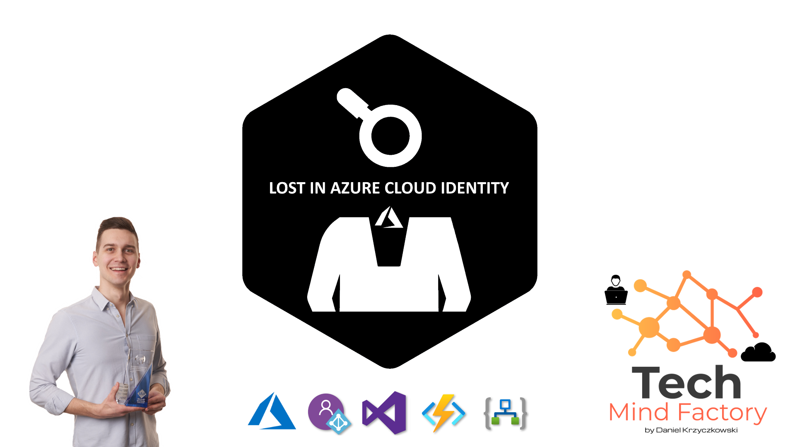
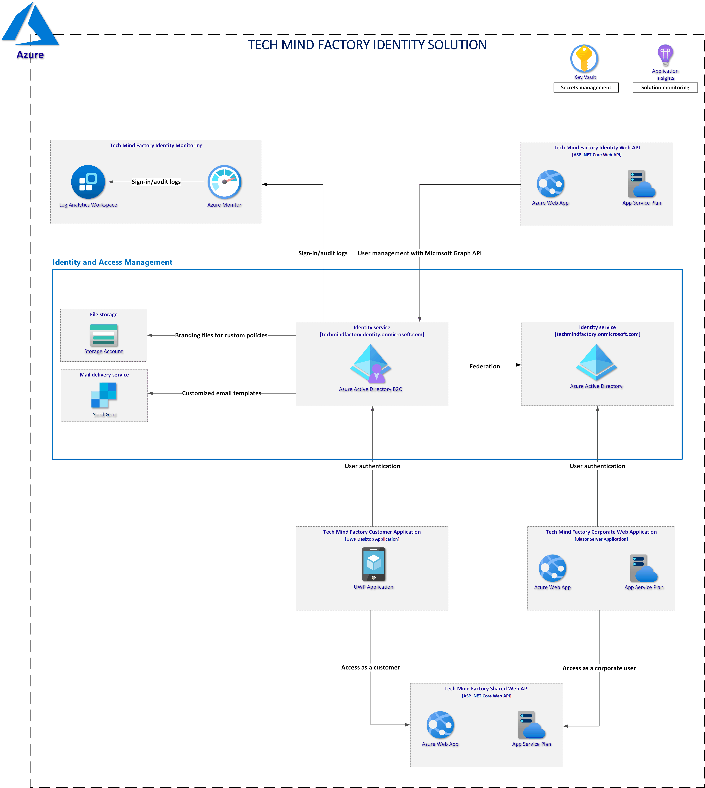
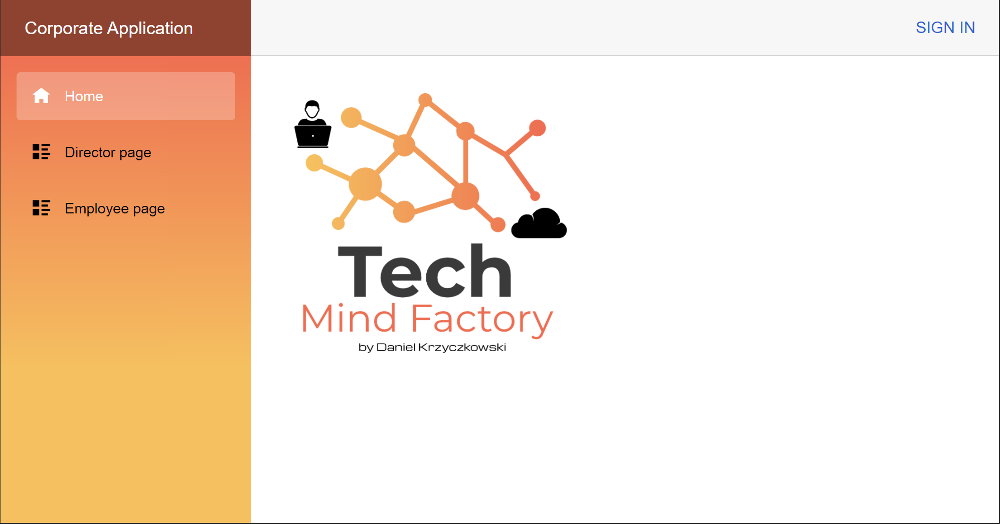
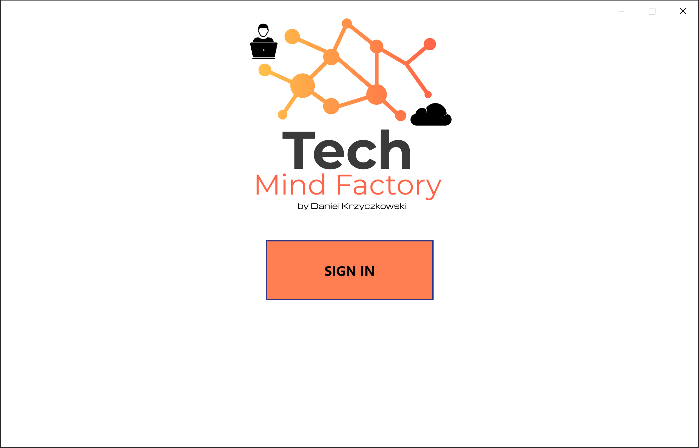
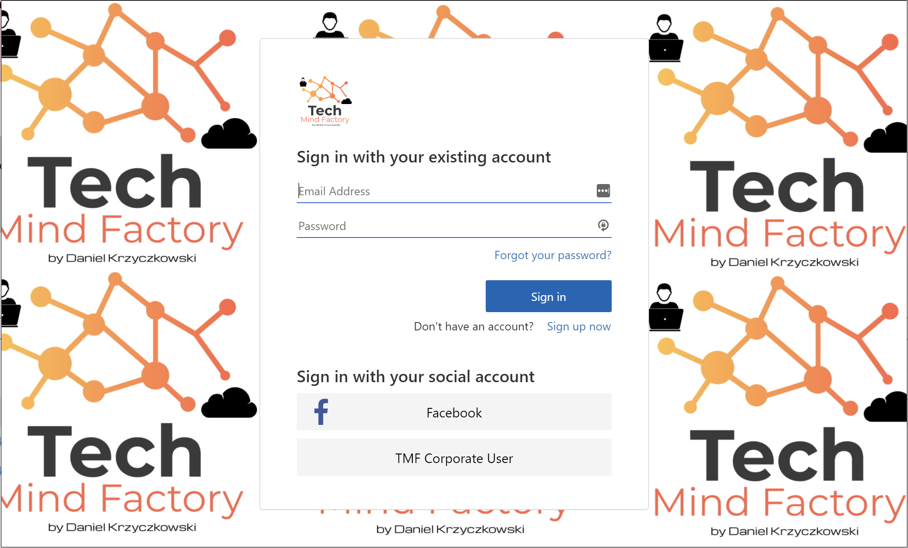
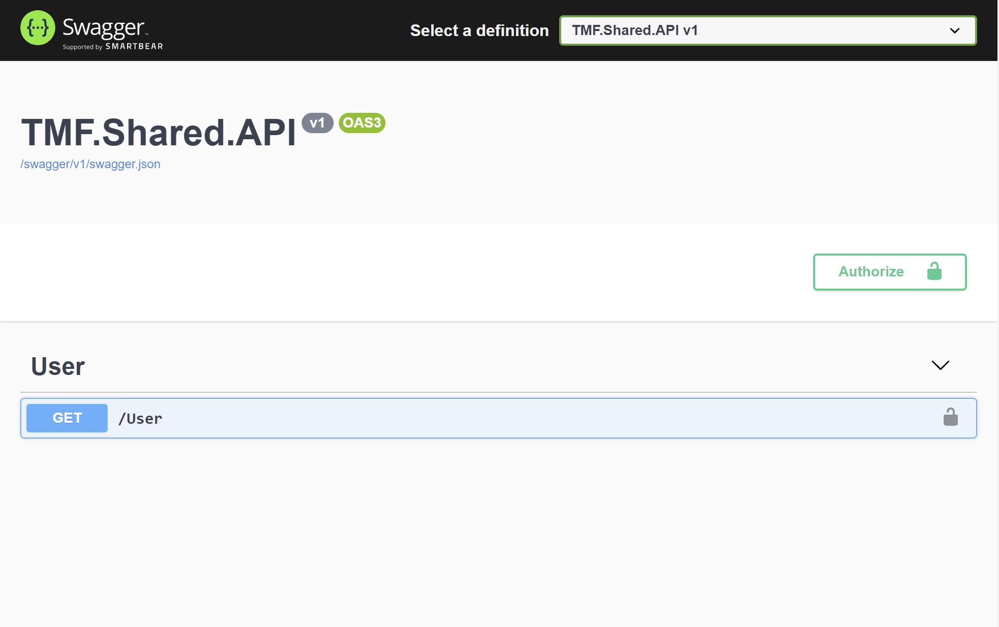
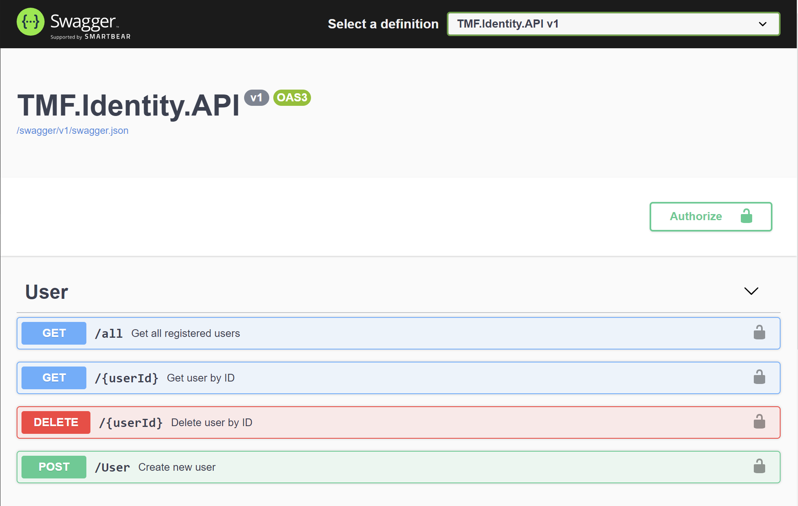

# Lost In Azure Cloud Identity
Tech Mind Factory Identity is a demo project to present how to use identity services available in the Azure cloud. 

*- On my [tech blog(https://techmindfactory.com/) there will be a series of articles explaining below concepts*

### 1. Secure solution with Azure Active Directory and Azure Active Directory B2C

In this article, we are going to focus on two main identity services available in the Azure cloud: Azure AD and Azure AD B2C. First, we will talk about the differences between these two services and when to use each one. We will talk about app registration in these services, scopes, and integration with libraries: Microsoft Identity Web and Microsoft Authentication Library.

### 2. User roles in an application using Azure AD App Roles

In this article, we will discuss authorization concepts and Azure Active Directory App Roles. We will discover how to handle authorization in web applications and how to validate user roles included in the JWT tokens.

### 3. Tailored user experience with Azure AD B2C custom policies and branded pages

In this article, we are going to talk about using Azure Active Directory B2C service to provide a tailored authentication experience for end-users (customers). We will talk about the Identity Experience Framework and custom policies. We will see how to apply custom branding (using HTML and CSS files) for login, and registration pages.

### 4. Custom email verification with SendGrid and Azure AD B2C

In this article, we will talk about integration between email delivery service called SendGrid and Azure Active Directory B2C service. We will discover how to send branded confirmation emails with OTP code when the user provides an email during the registration process.

### 5. User migration to Azure AD B2C using Microsoft Graph API

In this article, we will talk about user migration to Azure Active Directory B2C using Microsoft Graph API. We will talk about migration strategies and see how to create user accounts programmatically.

### 6. DevOps practices for Azure AD B2C custom policies and custom branding

In this article, we are going to focus on the DevOps practices for custom policies and branding files for Azure Active Directory B2C. We will see how to use Azure DevOps to automate the release process.

### 7. Azure Monitor integration with Azure AD B2C for sign-in and audit logs

In the last article, we are going to focus on the audit logs. We will see how to use Azure Monitor to route Azure Active Directory B2C (Azure AD B2C) sign-in and auditing logs to Log Analytics workspace to analyze data, create dashboards, and alert on specific events.

## Solution architecture

### Azure Active Directory and Corporate Web App

Azure Active Directory is used to manage access to corporate applications - in this case to the Tech Mind Factory Corporate Web Application. Employees of Tech Mind Factory company can sign in using their corporate accounts and access web app functionalities. Important fact - these employees can have different application roles assigned. The authorization mechanism implemented in the application prevents access to unauthorized pages once the user role is verified. Roles are injected in the tokens returned from the Azure Active Directory service, once the user is authenticated.

### Azure Active Directory B2C and Customer Desktop App

Tech Mind Factory company has also an application that is available for customers - Tech Mind Factory Customer Application. This is a desktop application (Universal Window Platform app) where customers can register and sign in. To easily manage users and their access to the application, Azure Active Directory B2C service is used. Why second Active Directory? Because we do not want to store user accounts, corporate users and customers, in one directory. What is more, we want to provide flexibility to customers so they can create their accounts themselves and use social media accounts (Facebook) to sign in. One important point - because of federation between Azure AD and Azure AD B2C tenants, Tech Mind Factory employees (corporate users) can access customer application using their corporate accounts registered in the Azure AD tenant.

### Tech Mind Factory Shared Web API

Web API is written in ASP .NET Core .NET 5, which returns data for both applications - TMF Customer Application and TMF Corporate Web Application. This Web API is written in a way that enables users to access tokens returned from both identity services - Azure Active Directory and Azure Active Directory B2C. I want to present how to use multiple bearer token authentication schemes.

### Tech Mind Factory Identity Web API

This API, written in ASP .NET Core .NET 5, was created to provide an easy way to create user accounts in the Azure AD B2C using Microsoft Graph API (programmatically) and to provide a migration mechanism. There are some scenarios in the real world where we want to migrate user account from one identity system to another. This API presents how to do it using Azure AD B2C and Microsoft Graph API.

### Tech Mind Factory Identity Monitoring

In the Tech Mind Factory corporation, there is a requirement to monitor Azure AD B2C tenants and collect sign-in and auditing logs. Azure Monitor is used to route Azure Active Directory B2C (Azure AD B2C) sign-in and auditing logs to Log Analytics workspace to analyze data, create dashboards, and alert on specific events.

### Key Vault and Azure Application Insights

Each solution requires good monitoring, this is why the Azure Application Insights service is used to monitor APIs performance and issues. Key Vault is a must-have if we want to store configuration securely in the cloud.
